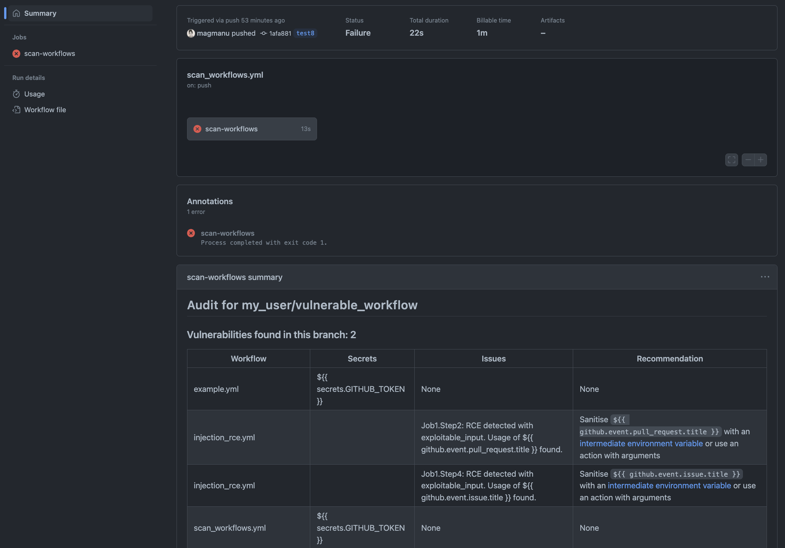

# GWoSS: Github Workflow Security Scanner


[](https://github.com/magmanu/github-workflow-security-scanner/actions/workflows/github-code-scanning/codeql)
[](https://github.com/dependabot)
[](https://github.com/psf/black)
<!--  -->
<!--  -->
<!-- [](https://github.com/magmanu/github_actions_auditor/commits/main) -->

**GWoSS** scans your GitHub Workflows for vulnerabilities, like a workflow SAST if you wanna go fancy. It looks for anti-patterns such as ingesting inputs in an unsafe manner or malicious commits in build process.

<br clear="right"/>

## Features



- **Security Scanning**: Checks all workflows in a specific branch (default: current branch)
- **CI**: Option to break the test if any workflow is vulnerable
- **Reporting**: Shows vulnerability report summary and suggest remediation

<br clear="left"/>

## Usage

Example of workflow that uses this action.  
*Optional*: Set `SHOULD_BREAK` to `true` if you'd like the tests to fail if a workflow vulnerability is found. Default is false.

```yml
name: Security Scan for Github Worflows
on: push

jobs:
  scan-workflows:
    runs-on: ubuntu-latest

    steps:
        - uses: magmanu/github-workflow-security-scanner@v0.1.0
          with:
            REPO_TOKEN: ${{ secrets.GITHUB_TOKEN }}
            SHOULD_BREAK: true
          env:
            REPOSITORY: ${{  github.repository }}
            BRANCH: ${{ github.ref_name}}

```
## Security

GWoSS uses GitHub's GraphQL endoint, so for the time being, it requires a classic token to run. Due to this, an API token is required. You can generate a basic PAT token with no read access for this.

## What checks are currently in place?

See them [here](scan_config.json)
## To do: Wanna Collaborate?

- [ ] [Feat] Enable org/user scan
- [ ] [Feat] Add `result.md` to PR comment
- [ ] [Feat] Add supply chain to `result.md` table and vulnerability count
- [ ] [Chore] Add tests


## Ideas for next steps

* Check if actions use full sha or tag rather than branch name
* Check for [GitHub Action evaluates curl's output](https://docs.boostsecurity.io/rules/cicd-gha-curl-eval.html)
* Check for [workflow inputs](https://docs.boostsecurity.io/rules/cicd-gha-workflow-dispatch-inputs.html)
* Check for [write-all](https://docs.boostsecurity.io/rules/cicd-gha-write-all-permissions.html)
* Add scan for intentional deprecated commands [ACTIONS_ALLOW_UNSECURE_COMMANDS](https://docs.boostsecurity.io/rules/cicd-gha-unsecure-commands.html) and `save-state` and `set-outout`?

## Notice

This was originally forked from [this repo](https://github.com/TinderSec/gh-workflow-auditor) and converted to a GitHub Action. I explicitly affirm that changes were made to the original code and am in good faith reproducing the copyright. I believe this is enough to fullfill the original copyright requirements.  
